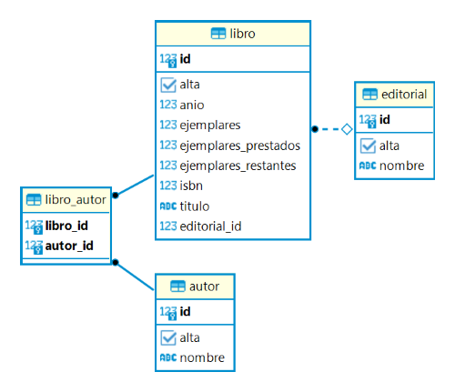

# Librería 📚

Este proyecto consiste en una API para gestionar el catálogo de una librería virtual, donde se pueden realizar operaciones CRUD en los modelos `Libro`, `Autor` y `Editorial`. También permite manejar préstamos de libros, el estado de disponibilidad, y la gestión de usuarios administrativos y visitantes que consultan el catálogo.

## Tecnologías Utilizadas

- **Java 8**
- **Gradle**: Para la gestión de dependencias y construcción del proyecto.
- **Spring Boot**: Framework utilizado para desarrollar la API REST.
  - **Spring Data JPA**: Manejo de datos y persistencia.
  - **Spring Web**: Desarrollo de servicios web.
- **Lombok**: Para reducir el código boilerplate en las entidades y servicios.
- **PostgreSQL**: Base de datos utilizada para almacenar la información.
- **DBeaver**: Herramienta para la administración de la base de datos.

## Modelos Principales

### Libro

Representa los libros disponibles para préstamo en la librería y contiene los siguientes atributos:

- `Long id`: Identificador único generado por la base de datos.
- `Long isbn`: Número ISBN del libro.
- `String titulo`: Título del libro.
- `Integer anio`: Año de publicación.
- `Integer ejemplares`: Número total de ejemplares.
- `Integer ejemplaresPrestados`: Número de ejemplares actualmente prestados.
- `Integer ejemplaresRestantes`: Número de ejemplares disponibles para préstamo.
- `Boolean alta`: Estado del libro (activo/inactivo).
- `Set<Autor> autores`: Relación de muchos a muchos con `Autor`.
- `Editorial editorial`: Relación de muchos a uno con `Editorial`.

### Autor

Representa los autores de los libros, con los siguientes atributos:

- `Long id`: Identificador único generado por la base de datos.
- `String nombre`: Nombre del autor.
- `Boolean alta`: Estado del autor (activo/inactivo).
- `Set<Libro> libros`:  Asociación con libros, ya que un autor puede estar relacionado con múltiples libros.

### Editorial

Representa las editoriales de los libros, con los siguientes atributos:

- `Long id`: Identificador único generado por la base de datos.
- `String nombre`: Nombre de la editorial.
- `Boolean alta`: Estado de la editorial (activo/inactivo).
- `Set<Libro> libros`: Asociación con libros publicados por la editorial.

## Estructura del Proyecto

- **DTOs y Mappers**: Clases de transferencia de datos (`LibroDtoAdmin`, `AutorDtoAdmin`, etc.) y mapeadores para gestionar la conversión entre entidades y DTOs.
- **Repository**: Interfaces que extienden `JpaRepository` para interactuar con la base de datos.
- **Service**: Lógica de negocio y operaciones CRUD para cada entidad (`LibroServicio`, `AutorServicio`, `EditorialServicio`).
- **Controller**: Controladores que manejan las peticiones y operaciones para cada entidad (`LibroController`, `AutorController`, `EditorialController`).

## Estructura de la Base de Datos

La siguiente imagen ilustra el diseño de la base de datos utilizado en el proyecto, incluyendo las relaciones entre las tablas principales (`libro`, `autor`, `editorial`) y la tabla intermedia `libro_autor` para manejar la relación de muchos a muchos entre libros y autores:



## Funcionalidades Principales

1. **Gestión de Libros**:
   - Crear, modificar, activar, desactivar y eliminar libros.
   - Consultar libros por diferentes criterios:
     - Listar todos los libros (administrador) o solo los libros disponibles (público).
     - Filtrar libros activos e inactivos (solo administrador).
     - Búsqueda por ISBN, título o año de publicación, con vistas específicas para administrador y público.
   - Consultar disponibilidad de ejemplares para préstamo.
   - Registrar préstamo y devolución de ejemplares.


2. **Gestión de Autores y Editoriales**:
   - Crear, modificar, activar, desactivar y eliminar autores/editoriales.
   - Consultar autores/editoriales por diferentes criterios:
     - Listado completo de autores/editoriales (administrador) o de aquellos activos (público).
     - Filtrar autores/editoriales activos e inactivos (solo administrador).
     - Búsqueda por nombre, con vistas para administrador y público.
   - Mostrar libros asociados al consultar un autor o una editorial.


3. **Roles de Usuario**:
   - **Administrador**: Permite la gestión completa de los libros, autores y editoriales, así como el control de préstamos y disponibilidad.
   - **Visitante**: Puede consultar los libros disponibles para préstamo y realizar búsquedas en el catálogo.

## Validaciones y Excepciones

- **Jakarta Bean Validation e Hibernate Validator**: Para validaciones en los DTOs durante las operaciones de guardado y actualización en `Libro`, `Autor` y `Editorial`.
- **Excepciones Personalizadas**:
  - `LibroEncontradoException`, `AutorEncontradoException`, `EditorialEncontradaException`: Se lanzan si se encuentra un duplicado en la base de datos.
  - `LibroNoEncontradoException`, `AutorNoEncontradoException`, `EditorialNoEncontradaException`: Se lanzan si el libro, autor o editorial no son encontrados en la base de datos.

## Formato de Requests

A continuación, se muestran ejemplos de los JSON esperados en las solicitudes para algunos de los métodos principales. Los valores de los atributos son de ejemplo y pueden variar según las necesidades del usuario.

### `saveLibro`
```json
{
    "isbn": 9789871234560,
    "titulo": "Libro",
    "anio": 2000,
    "ejemplares": 20,
    "ejemplaresPrestados": 0,
    "ejemplaresRestantes": 20,
    "alta": true,
    "autores": [
        {
            "nombre": "Autor",
            "alta": true
        }
    ],
    "editorial": {
        "nombre": "Editorial",
        "alta": true
    }
}
```

### `updateLibro`
```json
{
    "isbn": 9789871234560,
    "titulo": "Libro",
    "anio": 2000,
    "ejemplares": 20,
    "ejemplaresPrestados": 0,
    "ejemplaresRestantes": 20
}
```

### `saveAutor` y `saveEditorial`
```json
{
    "nombre": "Autor/Editorial",
    "alta": true
}
```

### `updateAutor` y `updateEditorial`
```json
{
    "nombre": "Autor/Editorial"
}
```

## Testing

El proyecto incluye pruebas unitarias para garantizar la correcta funcionalidad de los paquetes `model`, `repository`, `service` y `controller` en las entidades `Libro`, `Autor` y `Editorial`. Estas pruebas, implementadas con JUnit y Mockito, cubren las operaciones CRUD, consultas específicas, manejo de préstamos, y los endpoints de los controladores.